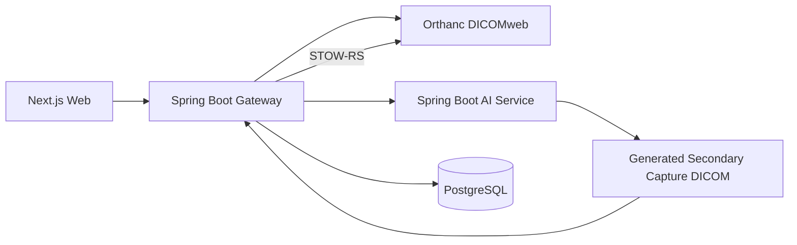

# Hanul AI-PACS Assistant

저장소에 포함된 익명화 DICOM 검사 데이터를 조회하고, AI 추론 전에 QC 게이트를 통과시키며, 데모 AI 결과를 새 DICOM 객체로 생성해 Orthanc PACS에 다시 저장하는 미니 PACS 데모 프로젝트입니다.

이 프로젝트는 병원용 실서비스가 아니라 포트폴리오/심사용 로컬 데모입니다. 실제 환자 데이터는 포함하지 않으며, AI 결과는 임상 진단이나 치료 판단에 사용할 수 없습니다.

## Competition Demo in 3 Minutes

1. Login with demo/demo
2. Open seeded anonymized sample study
3. Run QC Gate
4. Run AI Analysis
5. View original image, overlay, heatmap, score, generated DICOM UID
6. Confirm result DICOM was stored back to Orthanc and read-back verified
7. Open audit log and show every access event

## Why this project is different

- It is not a CRUD demo.
- It demonstrates a DICOMweb-based medical imaging workflow.
- It keeps original DICOM immutable.
- It blocks invalid/unsafe input through QC Gate.
- It generates a new Secondary Capture DICOM result object.
- It stores the generated result back to Orthanc through STOW-RS.
- It records audit logs.
- It uses anonymized demo-only sample DICOM files.

## Supported demo scope

This is not a full hospital PACS and not a full DICOM parser. The demo scope is intentionally narrow and honest:

- anonymized demo sample data only
- single-frame grayscale demo DICOM input
- uncompressed Explicit VR Little Endian preferred
- unsupported Transfer Syntax is rejected gracefully by QC
- DICOMweb workflow is implemented through Orthanc

Unsupported production scenarios include real patient data, compressed transfer syntaxes, multi-frame CT/MR, DICOM SR/SEG input, RTSTRUCT, and encapsulated PDF.

## 무엇을 하는 프로젝트인가

Hanul AI-PACS Assistant는 DICOMweb 기반 영상 워크플로를 end-to-end로 보여줍니다.

1. Orthanc에 저장된 익명화 샘플 DICOM study/series/instance를 조회합니다.
2. 선택한 DICOM 인스턴스를 PNG로 렌더링해 웹에서 미리 봅니다.
3. DICOM UID, Transfer Syntax, PixelData, 익명화 패턴, PHI 의심 문자열을 QC로 검사합니다.
4. QC가 `FAIL`이면 AI 추론을 차단합니다.
5. QC가 `PASS` 또는 `WARN`이면 Spring Boot AI 서비스가 데모 추론을 실행합니다.
6. overlay, heatmap, score, bounding box, 결과 JSON을 생성합니다.
7. overlay 이미지를 담은 Secondary Capture DICOM을 생성합니다.
8. 생성된 DICOM을 Spring Boot 게이트웨이가 PostgreSQL artifact로 저장하고 Orthanc에 STOW-RS로 업로드합니다.
9. STOW-RS 업로드 후 Orthanc read-back 검증으로 결과 DICOM 존재 여부를 확인합니다.
10. DICOM 조회, QC, AI 작업, STOW 업로드, read-back 검증 기록을 감사 로그와 AI job timeline으로 남깁니다.

## 현재 구현 상태

구현 완료:

- Docker Compose 기반 로컬 실행 환경
- Orthanc DICOMweb 서버와 `/dicom-web` 루트 구성
- 익명화 유방 CR/뇌 CT DICOM seed 데이터 복사/업로드 도구
- Spring Boot 게이트웨이
  - 세션 기반 데모 로그인: `demo/demo`
  - DICOM study/series/instance 조회
  - DICOM 원본 다운로드와 미리보기 프록시
  - QC 검증과 QC 리포트 저장
  - 비동기 AI job 생성/조회
  - AI job timeline 저장/조회
  - AI 결과 artifact 저장
  - 생성 DICOM STOW-RS 업로드
  - STOW 후 Orthanc read-back 검증
  - 감사 로그와 런타임 아키텍처 API
  - Swagger UI
- Spring Boot AI 서비스
  - DICOM 렌더링
  - WL/WW preset 전처리: `chest`, `lung`, `bone`, `auto`
  - 결정론적 `DEMO_FALLBACK` 추론
  - 선택적 ONNX Runtime provider
  - 실험적 Anthropic provider
  - overlay, heatmap, Secondary Capture DICOM 생성
- Next.js 웹 UI
  - 로그인 화면
  - 대시보드
  - 검사 목록 검색/필터
  - DICOM viewer와 메타데이터 확인
  - QC 게이트 화면
  - AI 작업 목록과 결과 상세 화면
  - 감사 로그 화면
  - Mermaid 아키텍처 화면
- 테스트/검증
  - backend JUnit 테스트
  - ai-service JUnit
  - web Playwright smoke test
  - 전체 서비스 smoke script

아직 운영 수준으로 구현하지 않은 것:

- 실제 병원 PACS/EMR 연동
- 실제 환자 데이터 처리
- 임상 검증된 AI 모델
- DICOM 표준 전체를 포괄하는 parser
- 사용자/권한/감사 정책의 운영 환경 수준 hardening
- 장기 보관용 object storage 연동

## 아키텍처



## 프로젝트 구조

```text
.
├─ web/                 # Next.js 16, React 19, Tailwind 웹 UI
├─ backend/             # Spring Boot 3.3 게이트웨이/API 서버
├─ ai-service/          # Spring Boot DICOM 렌더링/AI 추론 서비스
├─ orthanc/             # Orthanc 관련 문서
├─ tools/seed-dicoms/   # 샘플 DICOM 복사 및 STOW-RS seed 도구
├─ docs/                # API, DICOM flow, AI pipeline, QC 문서
├─ scripts/             # smoke test 스크립트
├─ docker-compose.yml
└─ Makefile
```

## 빠른 시작

필요한 것:

- Docker Desktop 또는 Docker Engine
- Make는 선택 사항입니다. Windows에서 Make가 없으면 `docker compose ...` 명령을 직접 실행하면 됩니다.

```bash
cp .env.example .env
docker compose up --build
```

접속 주소:

- Web: http://localhost:3000
- Backend Swagger: http://localhost:8080/swagger-ui.html
- Orthanc: http://localhost:8042

데모 계정:

- Web username: `demo`
- Web password: `demo`
- Orthanc username: `orthanc`
- Orthanc password: `orthanc`

`seed-dicoms` 서비스는 Compose 실행 시 `tools/seed-dicoms/samples/user-provided`에 포함된 익명화 DICOM만 Orthanc에 업로드합니다. Docker Compose로 실행할 때는 기존 Orthanc study를 지우고 이 샘플만 다시 넣으므로 화면에 다른 샘플 이미지가 남지 않습니다.

데이터를 수동으로 다시 넣고 싶으면 다음을 실행합니다.

```bash
make seed
```

Make가 없는 환경에서는 다음 명령을 사용합니다.

```bash
docker compose run --rm seed-dicoms
```

## AI provider 설정

기본값은 외부 API를 호출하지 않는 `DEMO_FALLBACK`입니다.

```bash
AI_PROVIDER=DEMO_FALLBACK
```

심사 기준 메인 provider:

- `DEMO_FALLBACK`: 모델 파일 없이 image intensity 기반으로 결정론적 데모 결과 생성
- `ONNX`: `MODEL_PATH`의 ONNX 모델을 사용
- `AUTO`: ONNX 모델 파일이 있으면 ONNX, 없으면 fallback 사용

실험적 provider:

- `ANTHROPIC`: 렌더링된 데모 PNG를 Anthropic API로 보내 데모 라벨/점수 생성

`ANTHROPIC`은 기본 비활성화 상태이며, 심사에 필요하지 않습니다. 데모 데이터 전용 실험 옵션이고 실제 환자 데이터에는 사용하지 마세요. 키를 쓰는 경우 `.env`에만 넣고 커밋하지 마세요.

```bash
AI_PROVIDER=ANTHROPIC
ANTHROPIC_API_KEY=
ANTHROPIC_MODEL=claude-sonnet-4-5
```

## 데모 진행 순서

1. http://localhost:3000 에서 `demo/demo`으로 로그인합니다.
2. `검사 목록`에서 샘플 DICOM 검사를 선택합니다.
3. DICOM 미리보기, WL/WW preset, 핵심 메타데이터, UID 복사를 확인합니다.
4. `QC 실행`으로 PASS/WARN/FAIL 리포트를 확인합니다.
5. `AI 분석 실행`으로 비동기 AI job을 생성합니다.
6. AI 결과 페이지에서 원본/결과 DICOM, heatmap, score, QC 요약, 생성 UID, STOW-RS 상태를 확인합니다.
7. `감사 로그`에서 DICOM 조회, QC, AI inference, STOW upload 이벤트를 확인합니다.
8. `아키텍처`에서 런타임 DICOMweb 흐름을 확인합니다.

## API 요약

Base URL: `http://localhost:8080`

주요 엔드포인트:

- `POST /api/auth/login`
- `POST /api/auth/logout`
- `GET /api/auth/me`
- `GET /api/health`
- `GET /api/health/full`
- `GET /api/dashboard`
- `GET /api/studies`
- `GET /api/studies/{studyInstanceUid}`
- `GET /api/studies/{studyInstanceUid}/series`
- `GET /api/studies/{studyInstanceUid}/instances`
- `GET /api/instances/{studyInstanceUid}/{seriesInstanceUid}/{sopInstanceUid}/metadata`
- `GET /api/instances/{studyInstanceUid}/{seriesInstanceUid}/{sopInstanceUid}/preview?window=chest`
- `GET /api/instances/{studyInstanceUid}/{seriesInstanceUid}/{sopInstanceUid}/dicom`
- `POST /api/qc/validate`
- `POST /api/qc/validate-upload`
- `POST /api/ai/jobs`
- `GET /api/ai/jobs`
- `GET /api/ai/jobs/{jobId}`
- `GET /api/ai/jobs/{jobId}/overlay.png`
- `GET /api/ai/jobs/{jobId}/heatmap.png`
- `GET /api/ai/jobs/{jobId}/result-dicom`
- `GET /api/ai/jobs/{jobId}/result-metadata`
- `GET /api/audit`
- `GET /api/architecture/runtime`
- `GET /api/demo/manifest`

자세한 내용은 [docs/API.md](docs/API.md)를 참고하세요.

## 테스트

개별 테스트:

```bash
cd ai-service && gradle test
cd backend && gradle test
cd web && npm test
```

전체 smoke test:

```bash
make smoke
```

`make smoke`는 backend, ai-service, Orthanc가 실행 중이고 샘플 DICOM 데이터가 시드되어 있다고 가정합니다.

성공 예시:

```text
Checking backend health...
Checking AI service health...
Checking Orthanc health...
Logging in to backend...
Listing studies...
Listing instances for 1.2.826...
Running QC...
Creating AI job...
Polling job ...
status=RUNNING
status=COMPLETED_VERIFIED
Verifying STOW and read-back status...
Verifying generated DICOM artifact...
Verifying audit log...
Smoke test passed: health, seeded study, QC, AI, STOW-RS, read-back, artifacts, and audit log verified.
```

## 주요 문서

- [DICOM 흐름](docs/DICOM_FLOW.md)
- [DICOM Conformance](docs/DICOM_CONFORMANCE.md)
- [Judge Demo Script](docs/JUDGE_DEMO_SCRIPT.md)
- [AI 파이프라인](docs/AI_PIPELINE.md)
- [QC Gate](docs/QC_GATE.md)
- [Sample QC Report](docs/SAMPLE_QC_REPORT.md)
- [Sample AI Result](docs/SAMPLE_AI_RESULT.md)
- [보안과 개인정보 보호](docs/SECURITY_AND_PRIVACY.md)
- [포트폴리오 발표 자료](docs/PORTFOLIO_PRESENTATION.md)
- [Roadmap](docs/ROADMAP.md)
- [Threat Model](docs/THREAT_MODEL.md)
- [Testing Strategy](docs/TESTING_STRATEGY.md)
- [DICOM Result Object](docs/DICOM_RESULT_OBJECT.md)
- [Error Catalog](docs/ERROR_CATALOG.md)

## 기술 결정

- 원본 DICOM은 수정하지 않고, AI 결과를 별도의 Secondary Capture DICOM으로 생성합니다.
- Spring Boot 게이트웨이는 워크플로 orchestration, 인증, 감사, DB 저장, Orthanc 연동을 담당합니다.
- DICOM pixel rendering과 AI 전처리는 Python/pydicom 쪽에 둡니다.
- Java QC parser는 게이트웨이에서 빠르게 검증할 수 있는 explicit VR 중심의 경량 parser입니다.
- AI job은 비동기로 실행되고 웹 UI는 job 상태를 polling합니다.
- AI job은 timeline 이벤트를 저장하며, STOW-RS 이후 Orthanc read-back 검증이 성공하면 `COMPLETED_VERIFIED`가 됩니다.
- 결과 overlay, heatmap, result DICOM은 데모를 단순화하기 위해 PostgreSQL `stored_artifacts`에 저장합니다.

## 문제 해결

- 검사 목록이 비어 있음: Orthanc가 뜬 뒤 `make seed` 또는 `docker compose run --rm seed-dicoms`를 실행합니다.
- Orthanc 연결 실패: `docker compose logs orthanc`를 확인합니다.
- AI job이 `BLOCKED_BY_QC`: QC 리포트를 확인합니다. `FAIL`이면 설계상 추론이 차단됩니다.
- AI job이 `COMPLETED_UNVERIFIED`: STOW는 성공했지만 Orthanc read-back 검증이 실패했습니다. Orthanc 로그와 생성 UID를 확인하세요.
- 미리보기 실패: seed tool에 포함된 uncompressed Explicit VR Little Endian DICOM인지 확인합니다.
- 로그인 문제: 로그아웃 후 `demo/demo`으로 다시 로그인합니다.
- Anthropic provider 실패: `.env`의 `ANTHROPIC_API_KEY`, `ANTHROPIC_MODEL`, 네트워크 접근 가능 여부를 확인합니다.
